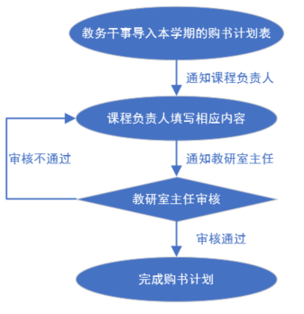
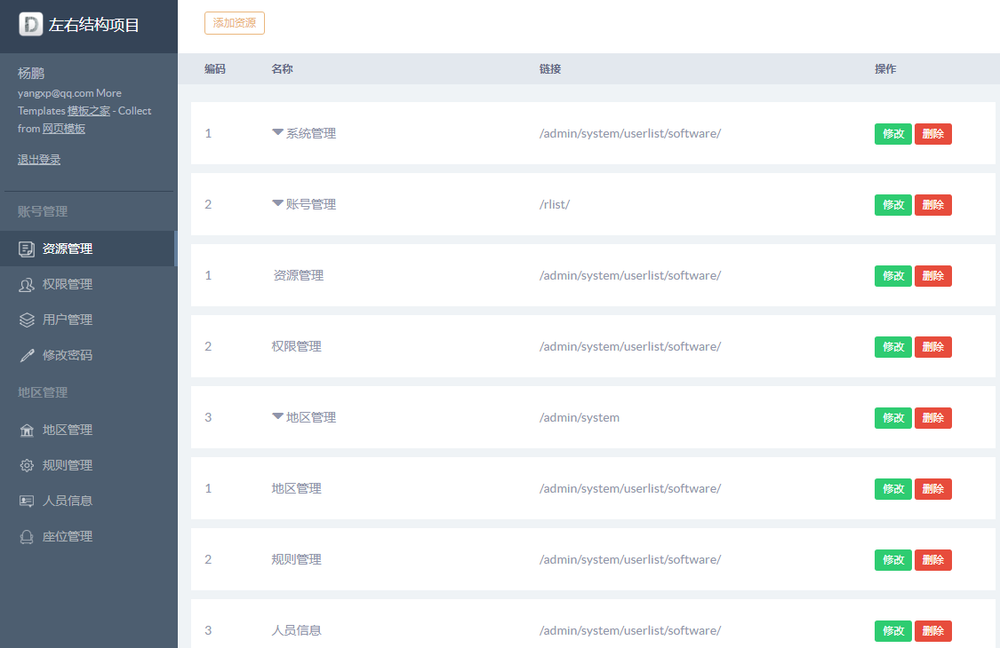
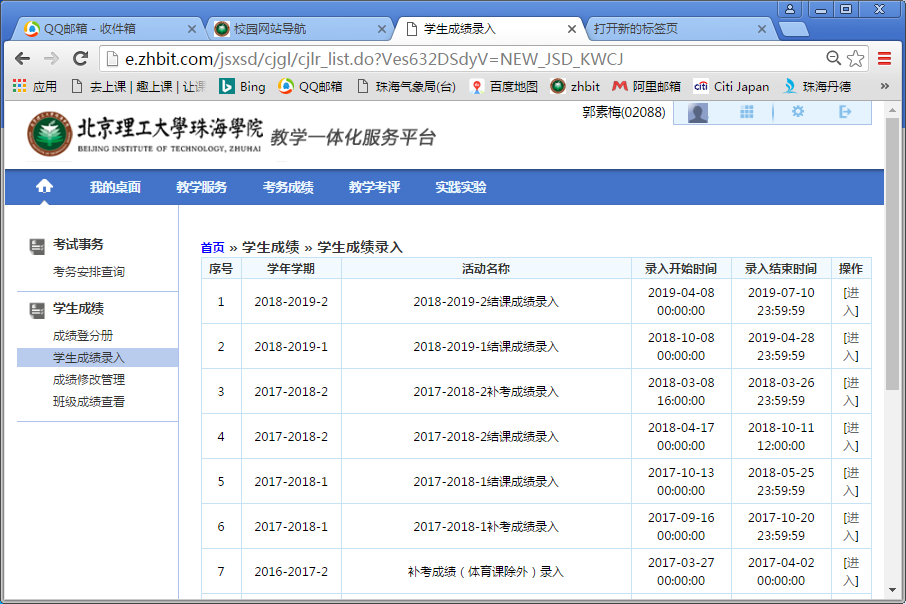
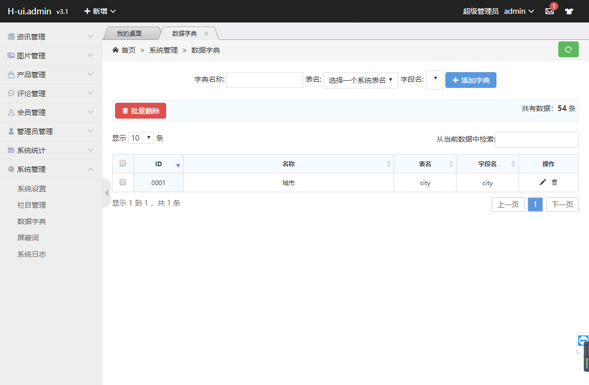
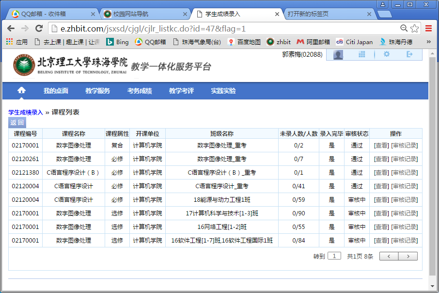
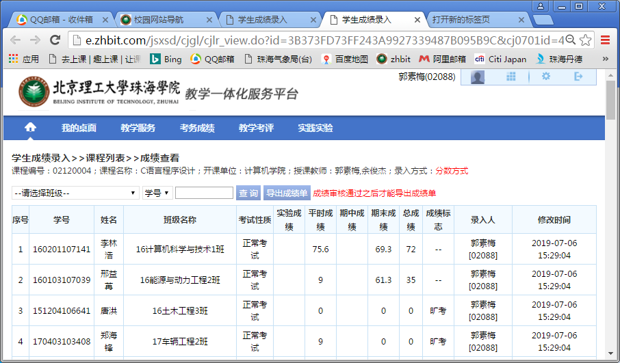
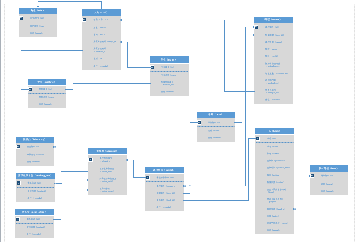

# 购书审批系统

## 目录
- 项目介绍
- 功能分析
- 一些说明
- 页面需求 
- 后端说明
## 项目介绍
> 学校每学期都会开设各种各样的课程，每门课程都会需要相对应的教材。然而教材的选取需要经过学校审批，按照目前情况，教材审批的工作都是由课程负责人填写审批表，然后提交，
> 最后等待教研室主任审批。因此课程负责人只能被动等待结果，不知道审批进度、审批出现的问题等情况，同时，每年都有许多重复的课程，但是每年都需要进行同样的工作，
> 实际上，重复的课程可以使用之前的审批过程，但是，上一次填写的审批表若丢失，又需要重新写，制造了许多不必要的麻烦。除此之外，如果课程是去年开的，
> 但是今年课程负责人换了，新课程负责人无法充分利用以往的资源，带来了许多不便。基于此类问题，设计人员开发了本系统。

## 功能分析
> 暂定需要四个角色：1.管理员 2.教务干事 3.课程负责人 4.教研室主任  
>
> 各角色功能：  
>   管理员：用于管理本系统  
>   教务干事：需要导入"[附件1，计划表](./file/附件1：北京理工大学珠海学院xxxx-xxx学年第x学期教材征订计划表.xls)"中的内容  
>   课程负责人：需要填写各自负责的"附件1，计划表"中的其他内容，如果上学年有教材已经录入，希望可以有是否采用原来的。采用的话，就不输入，不采用才重新输入。  
>   教研室主任：负责审核、输入各自教研室的负责老师填写的计划内容，有审核标记。审核后，导出“[附件1，审批表](./file/附件1：北京理工大学珠海学院教材选用审批表--dip.doc)”，
>   还需要导出“[附件4，统计表](./file/附件4：xxxx-xxxx学年第x学期境外原版教材检查情况统计表.xlsx)”  
> 
> 具体过程如下图所示：  
>   

## 一些说明
> 1. 本项目是有学院有真实需求作为背景的，学院教授直接指导和扶持的项目，后面会上线，如果效果不错会在全校推广，
> 后面还会申请大创以及发表著作权等福利（反正我不会坑你的，前提要靠谱） 
>
> 2. 加入项目组有三种选择，前端开发、后端开发、UI设计，具体要求如下所示：  
>   前端开发：html、css、javaScript、Ajax、git  
>   后端开发：Ajax、java、Spring、SpringMVC、MyBatis、Maven、git、MySQL  
>   UI设计：ps、html、css  
>
> 3. 加入我们考核内容   
>   - 前端开发：通过下面页面需求，利用后端api接口，进行页面**逻辑代码**的书写，页面样式等不作要求  
>   - 后端开发：将本仓库的代码在本地运行并了解其结构和每个类的作用   
>   - UI设计：通过页面需求，结合自己的**想法**进行页面设计
>   
>   如果你**完成**上述前端开发（后端开发/UI设计）的考核内容，请与我联系，联系方式
>   有微信：``duganlx``，QQ：``840797783`` 
>
> 4. 如果你有任何疑问，欢迎在本仓库的**Issues**中新建一个issue，我会定期查看并回复

## 页面需求
### 0. 说明：
> 1. 教师的画面大致如下。可以参考这些，设计管理者、教研室主任和教务干事的画面。 
> 2. 下述仅仅是**效果图**，并非**真正**的设计图，所以仅仅是诸如此类。所以需要自己思考下   

### 1.登录画面： 
   

### 2.登录后的首页：  
    

### 3.点击“图书申报列表”后的页面，将出现以前所有的图书申报情况。以前的只能看，本学期的可以填写：   
   

### 4.点击最右列的“进入”，可以进入所有以前学期的图书申报情况及内容，可以填写内容，但是不做能修改，比如上学期的，只能看“查看”和“审核记录”：   
   

### 5.本学期的：因为我已经都登录了，现在是录入完毕，就是“是”。可以“查看”和“审核记录”，可以有“审核状态”一栏  
   

### 6.如果没有录入，可以点击录入，则可具体录入。  
   

## 后端说明
### 工具安装
> IDEA（推荐）：java开发的IDE工具，也可以使用别的  
> Maven（必须）：管理jar包依赖  
> SQLyog（推荐）：MySQL的可视化工具，便于更好的操作数据库  
> git（必须）：进行版本控制及多人协同开发  
> postman（必须）：用于测试api接口
> IDEA中下载插件lombok（必须）：用于减少getter/setter等函数的书写    
>
> **推荐**表示可以不用或者使用其他的，**必须**表示必须安装

### 环境搭建
1. 先将该仓库以**Fork**方式拷贝到自己的github上（具体操作请**自行**查阅）  
2. 然后通过git将代码从自己的github上拉下来
3. 用IDEA打开该项目，项目会通过Maven自行下载相关依赖的jar包  
4. 运行程序  
5. 用postman或浏览器访问``http://localhost:8624/goushushenpixitong/test``，若出现以下json对象，
则证明环境搭建完成    
````
{
    "code": 200,
    "success": true,
    "message": "请求成功",
    "data": "mdzz"
}
````

### 数据库搭建
#### 建库
````
CREATE DATABASE goushushenpixitong;
````

#### 建表
````
/*1.学院*/
CREATE TABLE `institute` (
	`id` VARCHAR(100),
	`name` VARCHAR(255) NOT NULL,
	`remarks` VARCHAR(255),
	PRIMARY KEY ( `id` )
)ENGINE=INNODB DEFAULT CHARSET=utf8;

/*2.专业*/
CREATE TABLE `major` (
	`id` VARCHAR(100),
	`name` VARCHAR(255) NOT NULL,
	`institute_id` VARCHAR(100),
	`remarks` VARCHAR(255),
	PRIMARY KEY ( `id` ),
	CONSTRAINT `fk_major_institute` FOREIGN KEY(`institute_id`) REFERENCES `institute` (`id`)
)ENGINE=INNODB DEFAULT CHARSET=utf8;

/*3.人员*/
CREATE TABLE `staff` (
	`id` VARCHAR(100),
	`name` VARCHAR(150),
	`pwd` VARCHAR(255) DEFAULT "123456",
	`major_id` VARCHAR(100) NOT NULL,
	`institute_id` VARCHAR(100) NOT NULL,
	`tel` VARCHAR(50),
	`remarks` VARCHAR(255),
	PRIMARY KEY ( `id` ),
	CONSTRAINT `fk_staff_major` FOREIGN KEY(`major_id`) REFERENCES `major` (`id`),
	CONSTRAINT `fk_staff_institute` FOREIGN KEY(`institute_id`) REFERENCES `institute` (`id`)
)ENGINE=INNODB DEFAULT CHARSET=utf8;

/*4.角色*/
CREATE TABLE `role` (
	`id` VARCHAR(100),
	`type` INT NOT NULL,
	`remarks` VARCHAR(255),
	CONSTRAINT `fk_role_staff` FOREIGN KEY(`id`) REFERENCES `staff` (`id`)
)ENGINE=INNODB DEFAULT CHARSET=utf8;

/*5.学期*/
CREATE TABLE `term`(
    `id` INT UNSIGNED AUTO_INCREMENT,
    `name` VARCHAR(255) NOT NULL,
    `remarks` VARCHAR(255),
    PRIMARY KEY ( `id` )
)ENGINE=INNODB DEFAULT CHARSET=utf8;

/*6.课程*/
CREATE TABLE `course`(
    `id` VARCHAR(100),
    `term_id` INT UNSIGNED NOT NULL,
    `name` VARCHAR(255) NOT NULL,
    `period` INT UNSIGNED,
    `credit` INT UNSIGNED,
    `usable_range` VARCHAR(255) NOT NULL,
    `student_num` INT UNSIGNED NOT NULL,
    `teacher_num` INT UNSIGNED NOT NULL,
    `principal_id` VARCHAR(100),
    `remarks` VARCHAR(255),
    PRIMARY KEY ( `id`,`term_id`),
    CONSTRAINT `fk_course_staff` FOREIGN KEY(`principal_id`) REFERENCES `staff` (`id`),
    CONSTRAINT `fk_course_term` FOREIGN KEY(`term_id`) REFERENCES `term` (`id`)
)ENGINE=INNODB DEFAULT CHARSET=utf8;

/*7.教材等级*/
CREATE TABLE `level`(
    `id` INT UNSIGNED NOT NULL AUTO_INCREMENT,
    `name` VARCHAR(255) NOT NULL,
    `remarks` VARCHAR(255),
    PRIMARY KEY ( `id`)
)ENGINE=INNODB DEFAULT CHARSET=utf8;

/*8.书*/
CREATE TABLE `book`(
    `id` VARCHAR(150) NOT NULL,
    `name` VARCHAR(200) NOT NULL,
    `author` VARCHAR(255) NOT NULL,
    `publisher` VARCHAR(255) NOT NULL,
    `publish_date` VARCHAR(60) NOT NULL,
    `edition` INT UNSIGNED,
    `nation` VARCHAR(255),
    `type` INT UNSIGNED,
    `purpose` INT UNSIGNED,
    `level_id` INT UNSIGNED NOT NULL,
    `price` INT NOT NULL,
    `renew` bit ,
    `remarks` VARCHAR(255),
    PRIMARY KEY ( `id`),
    CONSTRAINT `fk_book_level` FOREIGN KEY(`level_id`) REFERENCES `level` (`id`)
)ENGINE=INNODB DEFAULT CHARSET=utf8;

/*9.课程用书*/
CREATE TABLE `subject`(
    `id` INT UNSIGNED AUTO_INCREMENT,
    `course_id` VARCHAR(100) NOT NULL ,
    `term_id` INT UNSIGNED NOT NULL,
    `book_id` VARCHAR(150) NOT NULL,
    `remarks` VARCHAR(255),
    PRIMARY KEY ( `id`),
    CONSTRAINT `fk_subject_term` FOREIGN KEY(`term_id`) REFERENCES `term` (`id`),
    CONSTRAINT `fk_subject_book` FOREIGN KEY(`book_id`) REFERENCES `book` (`id`),
    CONSTRAINT `fk_subject_course` FOREIGN KEY(`course_id`) REFERENCES `course` (`id`)
)ENGINE=INNODB DEFAULT CHARSET=utf8;

/*10.审批表*/
CREATE TABLE `approval`(
    `subject_id` INT UNSIGNED,
    `option_lab` VARCHAR(250) NOT NULL,
    `option_unit` VARCHAR(250) NOT NULL,
    `option_dean` VARCHAR(250) NOT NULL,
    CONSTRAINT `fk_approval_subject` FOREIGN KEY(`subject_id`) REFERENCES `subject` (`id`)
)ENGINE=INNODB DEFAULT CHARSET=utf8;

/*11.教研处*/
CREATE TABLE `laboratory`(
    `id` INT UNSIGNED AUTO_INCREMENT,
    `content` VARCHAR(255) NOT NULL,
    `remarks` VARCHAR(255),
    PRIMARY KEY ( `id`)
)ENGINE=INNODB DEFAULT CHARSET=utf8;

/*12.开课教学单位*/
CREATE TABLE `teaching_unit`(
    `id` INT UNSIGNED AUTO_INCREMENT,
    `content` VARCHAR(255) NOT NULL,
    `remarks` VARCHAR(255),
    PRIMARY KEY ( `id`)
)ENGINE=INNODB DEFAULT CHARSET=utf8;

/*13.教务处*/
CREATE TABLE `dean_office`(
    `id` INT UNSIGNED AUTO_INCREMENT,
    `content` VARCHAR(255) NOT NULL,
    `remarks` VARCHAR(255),
    PRIMARY KEY ( `id`)
)ENGINE=INNODB DEFAULT CHARSET=utf8;
````

#### 数据库表的关联关系
  

#### 说明
> 1. 表结构若看不清，可以下载visio，打开[数据库表设计图](./file/数据库表设计.vsdx)文件 
> 2. 数据库默认连接的是本人在学校中部署的云数据库,ip为``10.0.78.26``，
> 如果是在学校里，可以使用校园网访问到该云数据库，该云数据库用户名为``root``
> 密码为``123456``,请开发者不要更改其中的表结构以及删除他人插入的数据，也请不要**恶意**破坏。  

### API说明
com.ddu.goushushenpixitong.controller是存放接口的位置，下面以``BookController``类来讲述接口的使用：   
````
package com.ddu.goushushenpixitong.controller;

import ...

@RestController
@RequestMapping("/book")
public class BookController {

    private Logger logger = LoggerFactory.getLogger(this.getClass());

    @Autowired
    private BookService bookService;

    /**
     * 查询所有书本记录
     *
     * @param currentPage 当前页数
     * @param pageSize    每页显示的总记录数
     * @return
     */
    @GetMapping("/list")
    public CommonResult list(@RequestParam("currentPage") Integer currentPage, @RequestParam("pageSize") Integer pageSize) {
        return CommonResult.success(bookService.findBooksByPage(currentPage, pageSize));
    }

    /**
     * 查询单条记录
     *
     * @param id
     * @return
     */
    @GetMapping
    public CommonResult getOne(@RequestParam("id") String id) {
        return CommonResult.success(bookService.findById(id));
    }

    /**
     * 添加书本记录
     *
     * @param book
     * @return
     */
    @PostMapping
    public CommonResult register(Book book) {
        return CommonResult.expect(bookService.add(book));
    }

    /**
     * 更新
     *
     * @param book
     * @return
     */
    @PutMapping
    public CommonResult amend(@Valid Book book) {
        if (book.getId() == null) {
            return CommonResult.failure("id不能为空");
        }
        return CommonResult.expect(bookService.modify(book));
    }

    /**
     * 删除
     *
     * @param id
     * @return
     */
    @DeleteMapping
    public CommonResult delete(@RequestParam("id") String id) {
        return CommonResult.expect(bookService.remove(id));
    }
}

````
**1. 说明**  
该项目的端口号为``8624``，根目录是``/goushushenpixitong``，这些配置信息可以在``src/main/resources/application.properties``
查看
````
# application.properties

server.port=8624 //端口号
server.servlet.context-path=/goushushenpixitong //服务器根目录
````

**2. 查询所有书本记录接口说明**
````
// BookController

@RequestMapping("/book")
public class BookController {

    @Autowired
    private BookService bookService;

    /**
     * 查询所有书本记录
     *
     * @param currentPage 当前页数
     * @param pageSize    每页显示的总记录数
     * @return
     */
    @GetMapping("/list")
    public CommonResult list(@RequestParam("currentPage") Integer currentPage, @RequestParam("pageSize") Integer pageSize) {
        return CommonResult.success(bookService.findBooksByPage(currentPage, pageSize));
    }
````
假设我们要**查询图书列表**，应该在浏览器或postman中输入url为``http://localhost:8624/goushushenpixitong/book/list?currentPage=1&pageSize=3``  
- ``http://localhost:8624``：代表访问的服务器是在本机（localhost）的8624端口  
- ``/goushushenpixitong``：该服务器的根目录
- ``/book``：这个对应于``@RequestMapping("/book")``中括号中的值，代表访问该映射的类  
- ``/list``：这个对应于``@GetMapping("/list")``中括号中的值，访问该映射的函数，注意``GetMapping``代表url是用``get``请求来访问的
- ``?currentPage=1&pageSize=3``：这是对应函数中的两个参数变量，简单说就是访问该接口需要用户
传两个参数，这个可以通过注释中的``@param``来查看其含义

**3. 类比**
````
/**
* 查询单条记录
*
* @param id
* @return
*/
@GetMapping
public CommonResult getOne(@RequestParam("id") String id) {
	return CommonResult.success(bookService.findById(id));
}

/**
 * 添加书本记录
 *
 * @param book
 * @return
 */
@PostMapping
public CommonResult register(Book book) {
	return CommonResult.expect(bookService.add(book));
}

/**
 * 更新
 *
 * @param book
 * @return
 */
@PutMapping
public CommonResult amend(@Valid Book book) {
	if (book.getId() == null) {
		return CommonResult.failure("id不能为空");
	}
	return CommonResult.expect(bookService.modify(book));
}

/**
 * 删除
 *
 * @param id
 * @return
 */
@DeleteMapping
public CommonResult delete(@RequestParam("id") String id) {
	return CommonResult.expect(bookService.remove(id));
}
````
通过查询所有记录的接口分析，我们可以类比的看访问其他类型的接口：  
- **单条查询**即为``http://localhost:8624/goushushenpixitong/book/list?id=3``  
- **删除记录**即为``http://localhost:8624/goushushenpixitong/book/list?id=3``  

你一定会疑惑，单条查询的url与删除记录的url居然一模一样，那么如何区分这两个接口呢？  
>其实我采用RESTful API的设计原则，简单说就是通过不同的请求方式来进行判断，比如，当我发送
**查询**的url时，我使用的是``get``请求；而调用**删除**的url时，使用则是``delete``请求；**添加**记录的url
则使用``post``请求，**修改**记录时使用``put``请求。

所以你可以看到我不同方法上面标记的映射不同的方法：``xxxMapping``
````
@GetMapping    -->  get
@PostMapping   -->  post
@PutMapping    -->  put
@DeleteMapping -->  delete
````

还有一点也需要说明下，就是在添加接口和修改接口中，参数都是``Book book``，不是普通变量，那应该如何传值呢？  
> 基本类型的变量传值都是直接传相应的类型的值即可，像这种参数是一个对象的变量，传值应该根据该对象中定义的
> 变量来传值

````
// Book

package com.ddu.goushushenpixitong.entity;

import ...

/**
 * 图书
 */
@Data
@AllArgsConstructor
@NoArgsConstructor
@Accessors(chain = true)
public class Book {
    /**
     * 图书编号
     */
    @Id
    private String id;

    /**
     * 图书名字
     */
    @NotNull(message = "name不能为空")
    private String name;

    /**
     * 作者
     */
    private String author;

    /**
     * 出版社
     */
    private String publisher;

    /**
     * 出版时间
     */
    @Column(name = "publish_date")
    private String publishDate;

    /**
     * 版次
     */
    private Integer edition;

    /**
     * 所属国家
     */
    private String nation;

    /**
     * 类型（国外才有用到）
     * 例如：原版进口/影印/翻译/编译
     */
    private Integer type;

    /**
     * 用途（国外才有用到）
     * 例如：教材/教参/讲义/参考资料
     */
    private Integer purpose;

    /**
     * 教材等级
     */
    @Column(name = "level_id")
    @NotNull(message = "levelId不能为空")
    private Integer levelId;

    /**
     * 价格
     */
    private Integer price;

    /**
     * 若教材版次更新，是否还需要征求意见
     */
    private Boolean renew;

    /**
     * 备注
     * 用来放选择本书的理由
     */
    private String remarks;

}
````
上面这个类是``Book``的实体类，所以我们传值的时候就要给类中定义的变量进行传值，但是并不是所有都有
强制的要求``@NotNull(...)``标记的是必须传值的，其余可传值，也可不传。

**4. 说明**
1. 如果上述api说明没有听的很明白，可以自行查询相关知识
2. 代码中还有一些标签等没有讲解，也请自己查询了解

### 开发规范
>Dao 接口命名
>- insert
>- batchInsert
>- selectOne
>- selectById
>- count
>- selectList
>- update
>- deleteById  
>
>Service 接口命名
>- add
>- findById
>- findByXXX
>- findXXXList
>- modify
>- remove